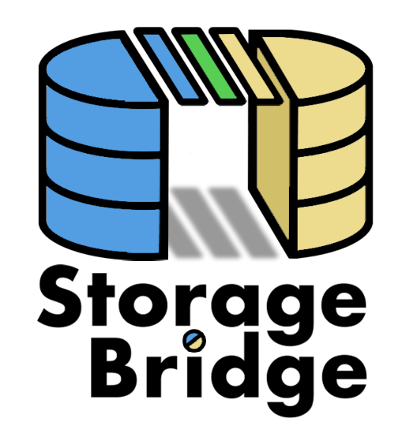

# storage-bridge

This project aim to be able to download documents from object storages such as S3 buckets and upload into Google drive.



## Git repositories

* Main repo: https://gitlab.comwork.io/oss/storage-bridge
* Github mirror: https://github.com/idrissneumann/storage-bridge.git
* Gitlab mirror: https://gitlab.com/ineumann/storage-bridge.git

## Image on the dockerhub

The image is available and versioned here: https://hub.docker.com/r/comworkio/storage-bridge

You'll find tags for arm32/aarch64 (optimized for raspberrypi) and x86/amd64 tags.

## Getting started

```shell
$ cp .env.dist .env # replace the environment values in this file
$ docker-compose -f docker-compose-local.yml up --force-recreate
```

And if you want to change the python sources, don't forget to rebuild:

```shell
$ cp .env.dist .env # replace the environment values in this file
$ docker-compose -f docker-compose-local.yml up --force-recreate --build
```

For generating a Google drive API key:
* [Enable this API](https://console.cloud.google.com/flows/enableapi?apiid=drive.googleapis.com)
* [Go to credentials](https://console.cloud.google.com/apis/credentials)
* Click Create Credentials > Service Account

The result should be like:


* Create a key and choose the JSON format and hash the content in base64


* Copy-paste the base64 content in the `GOOGLE_SA_B64` environment variable

* Create a folder on drive and share-it with the service account:


Copy-paste the folder id into the `GOOGLE_DRIVE_FOLDER_ID` environment variable

## Environment variables

* `LOG_LEVEL`: log level (`INFO`, `DEBUG`)
* `SLACK_TRIGGER`: enable/disable Slack (`on` or `off`)
* `SLACK_CHANNEL`: slack channel (i.e: `#storage-bridge`)
* `SLACK_TOKEN`: slack token
* `SLACK_USERNAME`: slack username
* `SLACK_EMOJI`: slack avatar based on an existing emoji (i.e: `:drive:`)
* `WAIT_TIME`: wait time during two scans in seconds (i.e: `3600` for one hour)
* `BUCKET_URL`: object storage's bucket URL
* `BUCKET_REGION`: object storage's region code
* `BUCKET_ACCESS_KEY`: object storage's access key
* `BUCKET_SECRET_KEY`: object storage's secret key
* `BUCKET_NAME`: bucket name
* `BUCKET_FOLDER`: bucket folder (it can be dynamique such as `YYYY-MM` for searching the current month folder `2023-01`)
* `GOOGLE_SA_B64`: google service account hashed in base64
* `GOOGLE_DRIVE_FOLDER_ID`: id of google drive target folder
* `REDIS_HOST`: redis host (redis is used to keep in cache, the files that were already uploaded)
* `REDIS_PORT`: redis port (i.e: `6379`)
* `REDIS_TTL`: redis retention time in seconds (i.e: `2678400` for 31 days)

## Restful API

### Healthcheck

```shell
$ curl localhost:8080/v1/health
{"status": "ok", "alive": true}
```

### Manifests

```shell
$ curl localhost:8080/v1/manifest 
{"version": "1.0", "sha": "1c7cb1f", "arch": "x86"}
```
